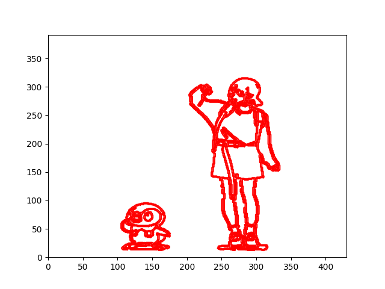

# PhotoGraph
**Version 1.0.0**
## Image Edge Tracer

### Description
PhotoGraph is an image border grapher. It uses OpenCV to manipulate the images in a way that removes noises and other processes that make it easier to find the edges.

### Motivation of Project
This idea started out as a playful bet/challenge. A classmate of mine wanted to use an already existing [program](https://github.com/kevinjycui/DesmosBezierRenderer) in Github. However, coming from windows, neither of us were able to use it as some packages don't work or will work but with lots of effort to understand and debug (or we just don't know how to download it, idk) in Windows. So, I tried to recreate it in my own way, using OpenCV, skimage, and matplotlib.

### What does it do?
**Version 1.0.0**

The main thing the grapher does is it graphs the edges of the given images into matplotlib. By sequencing these graphs together, we are then able to create a video or an animation.

### Output


### How to download?
First create a virtual environment in your preferred location and access it. Run the following command to download the packages in the requirements.txt

``` pip install -r requirements.txt ```

### Usage
Inside `./main/main.py` there are several settings you can change:
- CAMERA
  - Whether or not to use live camera as an input (laggy)
- SHOW_LIVE
  - If you want a running graph after procesing the input video/images into .mp4 or .gif
- VIDEO_SAVE_FRAMES
  - For input videos, whether or not to save frames in `./frames`
- INTERVAL (only if animating images)
  - How long the frames are shown in the processed video

### How it works?
There are three steps that it follows:

(1) Finding the edge of the images
- In this step, I used OpenCV's Bilateral Filter which is a edge-preserving, and noise-reducing smoothing filter for images. I then use its Canny Edge Detection to find the edges from the smoothened image. To see more how these functions work, check OpenCV's [documentation](https://docs.opencv.org/4.x/). Methods used in this step is inspired in [project inspiration](https://github.com/kevinjycui/DesmosBezierRenderer).

(2) Measuring the contours of the image
- In this step, I used skimage's `measure.find_contours`. To see how this functions works check [here](https://scikit-image.org/docs/stable/auto_examples/edges/plot_contours.html).


(3) Graphing the measured contours
- I this step, I graphed the measured contours into matplotlib. This was easily done via `ax.plot(x_contours, y_contours)`. There may be some manipulations done to correct the orientation of the graphed contours.

### Plans on the future:
I will probably not be working on it actively as it's just a For Fun project and a project to get experience on OpenCV, matplotlib, and a little bit of skimage (and as a programming challenge :>). However, like all my previous projects, I might edit them to fix something or add something, whatever it may be.

### Known Issues:
(a) On how it's currently done now, it's not the most efficient. There are still some things I could improve like maybe graphing only the parts that changed (I tried to use `blit=True` in matplotlib, I'm not sure if it worked). Another could be using better algortihms to do the things I have done or maybe even removing redundancies I might have done.

---

## License & Copyright
See the [LICENSE](LICENSE.md) file for license rights and limitations (MIT).
